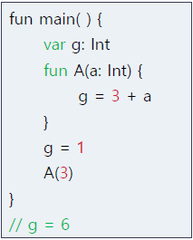
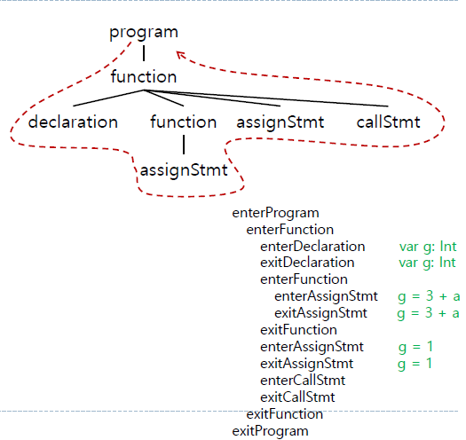
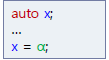
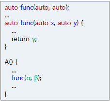
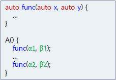

# 🖥️ 프로그래밍언어(구 컴파일러 + 컴퓨터언어) 수업 2번째 프로젝트

## ✅ 가상의 B언어 파일(.b)를 C언어로 변환하는 Parser 구현하기.

## ✅ ANTLR4, C++ Base

## ✅ Similar to B language defined in B.g4

## ✅ Develop B2CMain.cpp with B.g4

### ✅ Usage : $ make; ./b2c input.b > output.c

---

### ANTLR Listener
- Using only DFS for Listener in Code.
    
    ex)
    
    
    
    

### All types are specified as _auto_
- Actual supported types
- int, double, char, string, bool
---
### ANTLR based translator (visitor pattern based)

- B to C (Source code to Source code) compiler

- Type inference for implicitly typed variables (auto type)

- Build symbol table while traversing parse tree

- Use information in symbol table for type inference
---
### Type Inference
- Strong typed
-- No compatible types: only the same typed operands are allowed

- Inference

- variable declaration in auto statement

    
type( x ) == inferred_type α

- parameters and return type in function declaration

    

    return_type (func) == inferred_type ( γ ) from return

    type( x ) == inferred_type ( α ) from call site

    type( y ) == inferred_type ( β ) from call site

- Error cases
    
    1. Different types for the same variable

        

        
        inferred_type ( α ) != inferred_type ( β )

    2. Different function types for the same function

        

        
        inferred_type ( α1 ) != inferred_type ( α2 )

        inferred_type ( β1 ) != inferred_type ( β2 )